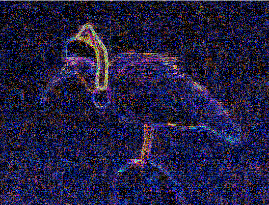
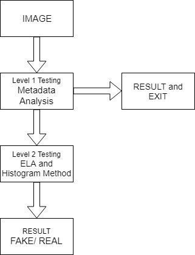
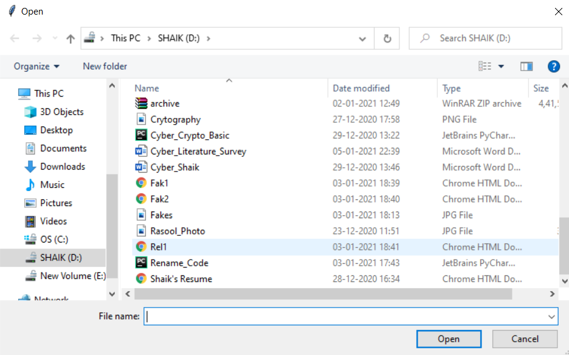
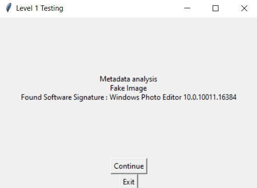
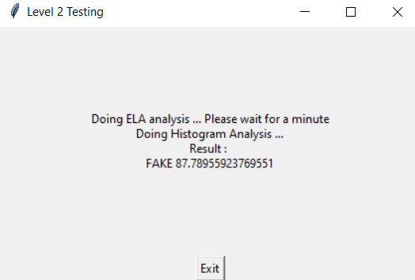
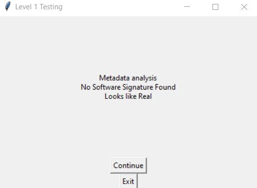
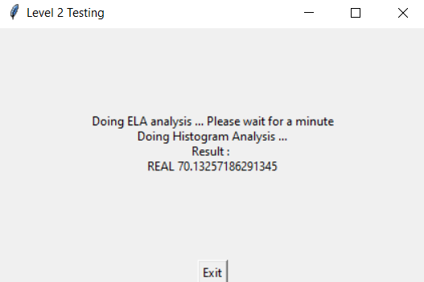

<b>Image Forgery Detection</b>
  
This project classifies the image to either real or fake image by doing two levels of testing. Fake images are the images that are digitally altered.

<b>Tools Used</b>
1.	Python 3.8   –  Programming Language
2.	OpenCV2      –  LBPH Face Recognizer
3.	Tkinter      –  Graphical User Interface
4.	Pillow       –  Images
5.	Numpy        –  Array 

<b>Level 1 Testing</b>

Whenever an image is altered using software tools, they leave software signatures in the metadata of the image. Level 1 testing exploit this feature and tries to find out traces of any signature. It is the fastest and simplest way to classify but there are online tools/websites that helps to clean this type of information in metadata. MS Paint is a good example that doesn't attach its signature in the metadata of the image.

<b>Level 2 Testing</b>

<b>Error Level Analysis (ELA)</b>. ELA is used to identify the areas in the image that have different compression rates. 
A JPEG image should have a similar level of overall image. If a part of the image has a very different error rate, then it may indicate a digital modification.
Level 2 Testing starts of by doing ELA (Error Level Analysis) on the image and the result is given to LBPH (Local Binary Patterns Histograms) recognizer which decides whether it is fake or real image. 
Even though LBPH algorithm is used for face recognition, it can be used in this project for generating histograms and comparing them.

In the above picture the christmas hat is added to the image.
As we discussed earlier, Now the compression rates differ in the image.

When we do ELA we can easily find the manipulated part of the image.

 
<b>Block Diagram/Work Flow Diagram</b>

 
<b>Steps:</b>

(1)	Install all the required software (Numpy, Pillow, OpenCV, OS)

(2)	Convert all the images which are present in Data Set into Grayscale images.

(3)	Convert Grayscale images to unsigned 8-bit integer and store in a NumPy. Array.

(4)	Train the LBPH Face Recognizer with the images.

(5)	Save the Trained data into "Training.yml" file.

(6)	Upload an image to check whether it is a fake or real image.

(7)	Algorithm runs Level 1 Testing (Metadata Analysis).

(8)	After Level 1 the Algorithm takes care of Level 2 Testing (ELA and Histogram Method) with reference to the "Training.yml".

<b>Output Screenshots:</b>

<b>Opening the Fake image</b>

 
<b>Level 1 Testing for Fake Image</b>

 
<b>Level 2 Testing for Fake Image</b>

 
Here the uploaded Image is Fake and the accuracy is nearly 88%

<b>Opening the Real Image</b>

 
<b>Level 1 Testing for Real Image</b>

 
<b>Level 2 Testing for Real Image</b>

 
Here the uploaded image is Real and the accuracy is 70%

